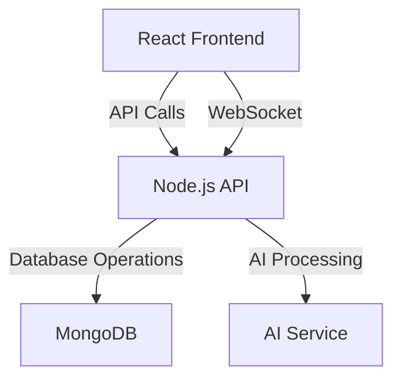

# JARIS - Technical Documentation

## 📚 Table of Contents
1. [Architecture Overview](#-architecture-overview)
2. [Project Structure](#-project-structure)
3. [Component Documentation](#-component-documentation)
4. [API Reference](#-api-reference)
5. [Database Schema](#-database-schema)
6. [Development Guide](#-development-guide)
7. [Deployment](#-deployment)
8. [Troubleshooting](#-troubleshooting)

## 🏗️ Architecture Overview

JARIS follows a modern web application architecture with a React frontend and Node.js backend, using MongoDB for data persistence.



## 📁 Project Structure

```
src/
├── components/         # Reusable React components
│   ├── AIMode.tsx     # AI chat interface
│   └── PCControlMode.tsx # System control interface
├── lib/
│   ├── db.ts          # MongoDB connection and utilities
│   └── utils/         # Helper functions
├── pages/
│   ├── api/
│   │   ├── ai/        # AI-related API endpoints
│   │   └── command/   # Command execution endpoints
│   └── _app.tsx       # Main application wrapper
├── styles/            # Global styles
└── types/             # TypeScript type definitions
```

## 🧩 Component Documentation

### AIMode Component

**Location**: `src/components/AIMode.tsx`

**Description**:
Handles the AI chat interface, including voice input/output and message display.

**Props**:
- `initialMessages`: Array of initial chat messages (optional)

**State**:
- `messages`: Array of chat messages
- `isListening`: Boolean for voice input state
- `isSpeaking`: Boolean for text-to-speech state

### PCControlMode Component

**Location**: `src/components/PCControlMode.tsx`

**Description**:
Provides system command execution and file management interface.

**State**:
- `command`: Current command input
- `output`: Command execution output
- `isExecuting`: Command execution state

## 🌐 API Reference

### AI Chat

**Endpoint**: `POST /api/ai/chat`

**Request Body**:
```typescript
{
  messages: Array<{
    role: 'user' | 'assistant';
    content: string;
  }>;
}
```

**Response**:
```typescript
{
  role: 'assistant';
  content: string;
}
```

### Command Execution

**Endpoint**: `POST /api/command/execute`

**Request Body**:
```typescript
{
  command: string;
}
```

**Response**:
```typescript
{
  success: boolean;
  output: string;
  isError?: boolean;
  error?: string;
}
```

## 🗃️ Database Schema

### Chat Messages
```typescript
{
  _id: ObjectId;
  role: 'user' | 'assistant';
  content: string;
  timestamp: Date;
  userId: string; // For multi-user support
}
```

### Command History
```typescript
{
  _id: ObjectId;
  command: string;
  output: string;
  timestamp: Date;
  success: boolean;
  userId: string;
}
```

## 🛠️ Development Guide

### Prerequisites
- Node.js 18+
- MongoDB 6.0+
- npm 9+

### Setup
1. Clone the repository
2. Install dependencies: `npm install`
3. Set up environment variables (see `.env.example`)
4. Start development server: `npm run dev`

### Testing
Run tests with:
```bash
npm test
```

### Linting
Check code style:
```bash
npm run lint
```

## 🚀 Deployment

### Production Build
```bash
npm run build
```

### Environment Variables
Required environment variables:
```
MONGODB_URI=your_mongodb_connection_string
NODE_ENV=production
PORT=3000
```

### Docker
A `Dockerfile` is provided for containerized deployment:
```bash
docker build -t jaris-assistant .
docker run -p 3000:3000 -e MONGODB_URI=your_uri jaris-assistant
```

## 🐛 Troubleshooting

### Common Issues

**MongoDB Connection Failed**
- Verify `MONGODB_URI` is correctly set
- Check network connectivity to MongoDB
- Ensure MongoDB is running

**Build Errors**
- Clear node_modules and reinstall: `rm -rf node_modules && npm install`
- Check TypeScript errors
- Ensure all dependencies are installed

**API Errors**
- Check server logs for detailed error messages
- Verify CORS settings
- Ensure required environment variables are set

## 📝 License

This project is licensed under the MIT License - see the [LICENSE](LICENSE) file for details.
