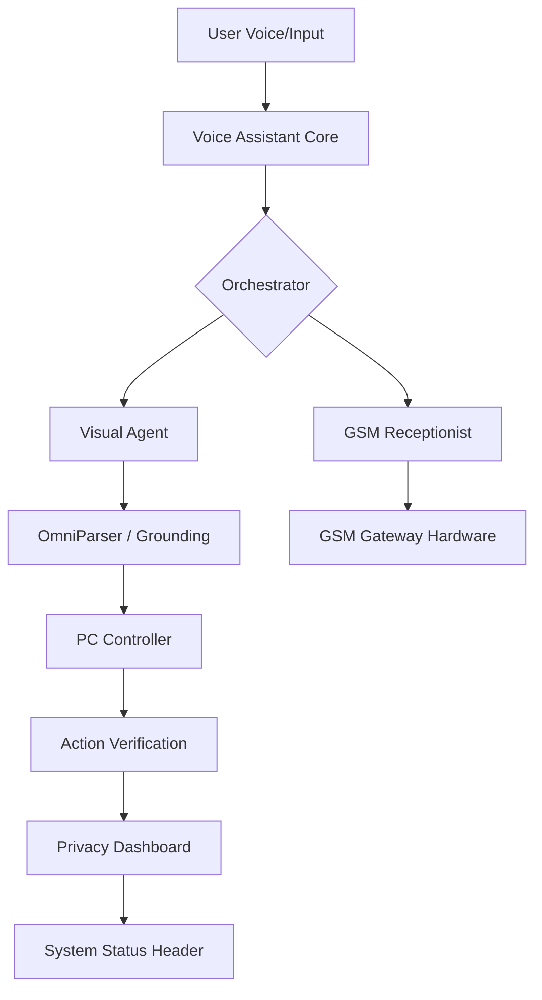

# 🐺 Wolf AI 2.0: Professional Desktop Automation Agent

Wolf AI 2.0 is a premium, localized AI desktop agent designed for human-like interaction and autonomous PC control. Unlike standard automation tools, Wolf 2.0 perceives your screen visually using **OmniParser**, interacts via emotional **Voice Intelligence**, and manages your telephony through a direct **GSM Hardware Gateway**.

## 🌟 Key Capabilities

### 👁️ Visual Perception & Grounding
Wolf 2.0 doesn't rely on hardcoded coordinates or brittle APIs.
- **OmniParser Integration**: Sees buttons, icons, and windows exactly as a human does.
- **Visual Verification**: Captures screenshots after actions to verify that windows opened or tasks succeeded.
- **Clarification Bridge**: If a UI element is ambiguous, Wolf pauses and shows you a "Visual Clarification" modal, asking you to point to the correct element.

### 🎙️ Emotional Voice Intelligence
- **RealTimeSTT**: Zero-latency speech recognition with robust wake-word detection.
- **Metacognition & Reasoning**: Wolf "thinks out loud" before acting, providing transparency via the execution stream.
- **Personality System**: Adaptive communication styles that respond to your emotional state.

### 📞 Professional GSM Telephony
A fully standalone call management system with zero cloud dependency.
- **Hardware Gateway**: Connects via Serial (AT Commands) to physical SIM800L modules.
- **Audio Routing**: Dynamic hardware switching between system audio and the GSM line-in/out.
- **Receptionist Mode**: Schedule directives for Wolf to answer calls, handle conversations using an LLM, and notify you for handover via a high-priority dashboard modal.

---

## 🏗️ Architecture Map



## 🛠️ Getting Started

### 1. Requirements
- **Python 3.10+**
- **Node.js 18+**
- **GSM Hardware**: (Optional) SIM800L + USB-to-TTL Serial Adapter.
- **Models**: Ollama (Llama 3 / Qwen) running locally.

### 2. Quick Start
Run the professional startup script:
```bash
python start_wolf_ai.py
```
This script will verify your dependencies (sounddevice, RealtimeSTT, etc.) and launch both the Backend API and the HUD Dashboard.

### 3. Hardware Setup
For physical telephony integration, please see [GSM_SETUP.md](file:///Users/qadirdadkazi/Desktop/Github%20Clones/Ai-Assistant-Pc-Controll/docs/GSM_SETUP.md).

---

## 🛡️ Privacy & Safety
Wolf 2.0 follows a **Local-First** philosophy.
- **Safety Sandbox**: High-risk actions (shutdown, code execution) require manual approval via the UI.
- **Zero Cloud Leakage**: Voice, vision, and calls are processed entirely on your local machine.
- **Transparency**: Every thought and visual reasoning step is logged in the real-time execution stream.

---

> Built with ❤️ by Qadirdad Kazi
