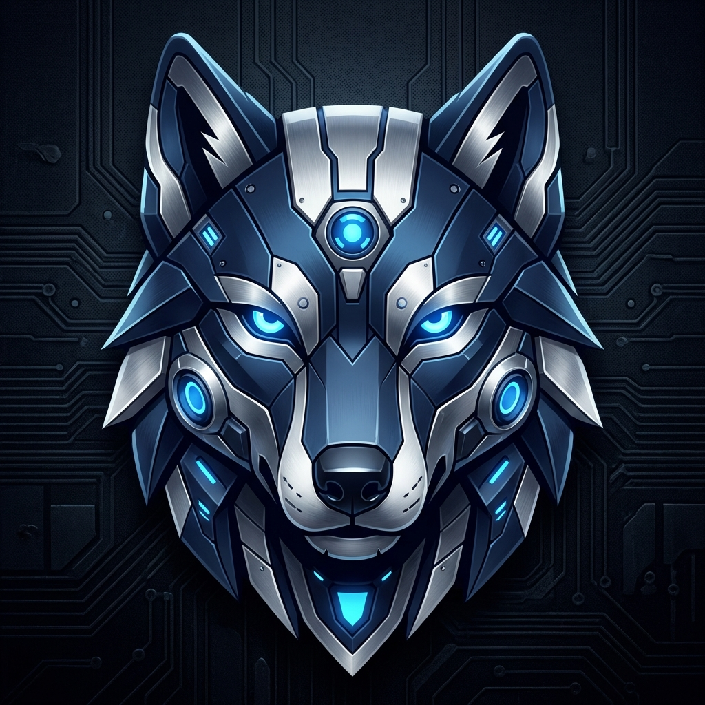

#  Wolf AI 2.0: The Ultimate "God-Mode" PC Agent

<p align="center">
  
  
  
  
  
</p>

---

## 🌌 Overview
**Wolf AI 2.0** is a state-of-the-art, privacy-first autonomous agent that lives on your PC. It doesn't just "chat"—it **sees**, **hears**, **thinks**, and **controls**. Built on a modular "Capability Stack," Wolf leverages local VLMs (Vision Language Models) and custom grounding engines to transform your Desktop into an intelligent, voice-commanded cockpit.

> [!IMPORTANT]
> **100% Local Logic.** No cloud latency. No subscription fees. No privacy leaks. Wolf is your personal AI sovereign.

---

## ⚡ God-Mode Intelligence Matrix

| Capability | Module | Description |
|:---:|:---:|---|
| 👁️ **Omni-Vision** | `VisionAgent` + `OmniParser` | Pixel-perfect UI grounding. Finds buttons, icons, and input fields with surgical precision using Microsoft's OmniParser V2. |
| 🎵 **Neural Sonic** | `Kokoro-82M` TTS | Ultra-human, low-latency speech synthesis. Sounds like a living assistant, not a robotic script, with real-time HUD status syncing. |
| 🔍 **Deep Research** | `Crawl4AI` + `Playwright` | Autonomous web intelligence. Wolf browses live websites, bypasses overlays, and extracts deep markdown data to answer complex questions. |
| 🧠 **Quantum Recall** | `InteractionMemory` | Built-in autonomous memory. Wolf remembers your preferences, past reasoning stages, and specific habits across sessions. |
| 📞 **Receptionist** | `GSM/SIP Bridge` | Intercepts physical phone calls via hardware modems. Features an intelligent **Handover Protocol** to bridge calls to your speakers. |
| 💻 **Dev Agent** | `Vite Scaffolder` | Ask for a website; Wolf builds it. It initializes the workspace, runs CLI commands, and generates beautiful React/HTML code. |
| 🛡️ **Bug Watcher** | `OCR Proactive Layer` | Monitors your screen for crashes, tracebacks, or system errors and alerts you before you even notice them. |

---

## 🏗️ Technology Stack

<p align="center">
  <code></code>
  <code></code>
  <code></code>
  <code></code>
  <code></code>
  <code></code>
</p>

- **Core Reasoning:** Function-Gemma & Llama 3.2 (3B) via Ollama.
- **Visual Grounding:** Microsoft OmniParser V2 + LLaVA-phi3.
- **Audio Engine:** RealTimeSTT + Kokoro-82M (Neural Sonic).
- **Web Intelligence:** DuckDuckGo Search + Crawl4AI (Deep Scraping).
- **GUI Framework:** PySide6 with custom Fluent-Widgets and Glass Effects.

---

## 🚀 Rapid Deployment

### 1. Engine Core (Ollama)
Ensure Ollama is running, then pull the required brains:
```bash
ollama pull llama3.2:3b         # General reasoning
ollama pull llava-phi3          # Vision agent
```

### 2. Physical Setup
```bash
# Clone the core
git clone https://github.com/Qadirdad-Kazi/Ai-Assistant-Pc-Controll.git
cd Ai-Assistant-Pc-Controll

# Environment setup
conda create -n wolf python=3.11 -y
conda activate wolf
pip install -r requirements.txt
playwright install
```

### 3. "God-Mode" Vision Bridge
To enable pixel-perfect UI control, run the OmniParser REST server:
```bash
python engines/omni_parser/download_weights.py  # Download 1.5GB weights
python engines/omni_parser/omni_server.py      # Starts server on port 8001
```

### 4. Ignite
```bash
python main.py
```

---

## 📖 Operational Command Set

- **"Wolf, click on the Chrome Search bar"** → Triggers Omni-Vision grounding.
- **"Wolf, research the architecture of Llama 3.2"** → Triggers Deep Web Research.
- **"Wolf, build a React habbit tracker in dark mode"** → Triggers Dev Agent Scaffolding.
- **"Wolf, tell me about your memory of our last session"** → Triggers Quantum Recall.

---

## 🧪 Advanced Documentation & Testing
Explore our deep-dive guides to unlock the full potential of your assistant:

- 🧪 **[ULTIMATE_ENHANCEMENT_TESTING.md](docs/ULTIMATE_ENHANCEMENT_TESTING.md)**: The definitive guide to testing Vision, Memory, and Research.
- 📞 **[PHONE_INTEGRATION_GUIDE.md](docs/PHONE_INTEGRATION_GUIDE.md)**: Wiring GSM modems for receptionist mode.
- 🎙️ **[WAKE_WORD_GUIDE.md](docs/WAKE_WORD_GUIDE.md)**: Tuning STT for zero-latency performance.

---

<p align="center">
  <strong>The Wolf is no longer just watching. It is leading.</strong><br>
  Designed by <strong>Qadirdad-Kazi</strong> | 2026 AI Sovereign Project
</p>
